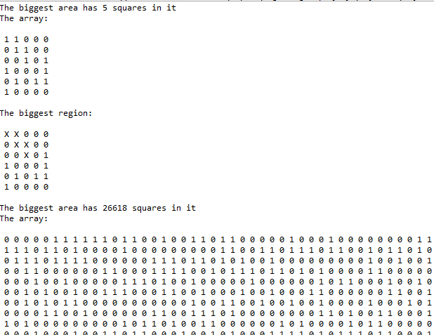
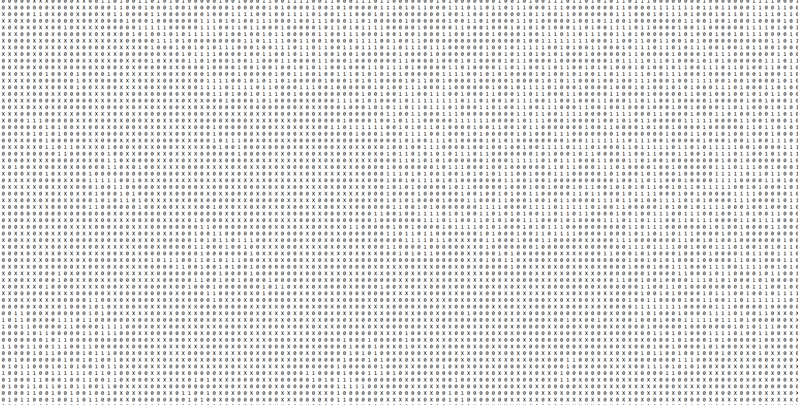

# RegionFinder

Problem statement:
Given a matrix where each element can be 0 or 1. Two cells are said to be connected if they are adjacent to each other horizontally, vertically, or diagonally. The connected cells that are filled with 1s form a region (also called island or cluster).  There may be several regions in the matrix.  Design a backtracking algorithm to find the largest region.  For example, the following matrix has 3 regions and, region 1 is the largest.

Two Test Cases included as Junit tests, and also included in the main method of AreaFinder.

Test Case 1 (small): The largest area is 5.

Test Case 2(large, 1000x1000 randomly generated array using a set RNG seed): The largest area is 26618. Takes ~ 2 minutes on my computer.

